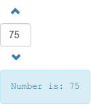

angular-bootstrap-numberpicker
==============================

Number picker for Angular UI Bootstrap

See it in use here: http://bmaupin.github.io/

Screenshot:  

To build:

1. Install Node.js

        sudo apt-get -y install nodejs npm

2. Update Node.js

        sudo npm update -g npm
        
3. Install Grunt

        sudo npm install -g grunt-cli
    
4. Install dependencies

        npm install

5. Build

        grunt
